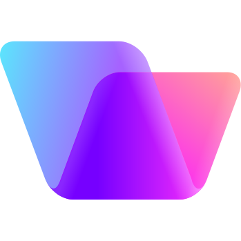

<div id="top"></div>


<!-- PROJECT SHIELDS -->
<!--
*** I'm using markdown "reference style" links for readability.
*** Reference links are enclosed in brackets [ ] instead of parentheses ( ).
*** See the bottom of this document for the declaration of the reference variables
*** for contributors-url, forks-url, etc. This is an optional, concise syntax you may use.
*** https://www.markdownguide.org/basic-syntax/#reference-style-links
-->
[![Contributors][contributors-shield]][contributors-url]
[![Forks][forks-shield]][forks-url]
[![Stargazers][stars-shield]][stars-url]
[![Issues][issues-shield]][issues-url]
[![MIT License][license-shield]][license-url]


<br>

# &nbsp;Vivid

<h1 align="center">
  
  Vivid
</h1>

<!-- PROJECT LOGO -->
<br />
<div align="center">
  <a href="https://github.com/vonage/vivid-3">
    
  </a>

<h1 align="center">Vivid</h1>

  <p align="center">
    Vivid is Vonage's design system platform targeted to provide incorporated, battery-charged web components.
  </p>
  <a href="https://github.com/vonage/vivid-3"><strong>Explore the docs »</strong></a>
  <br />
  <br />
  <a href="https://github.com/Vonage/vivid-3/issues/new?assignees=&labels=&template=bug_report.md&title=">Report Bug</a>
  ·
  <a href="https://github.com/Vonage/vivid-3/issues/new?assignees=&labels=&template=feature_request.md&title=">Request Feature</a>
</div>


<!-- TABLE OF CONTENTS -->
<details>
  <summary>Table of Contents</summary>
  <ol>
    <li>
      <a href="#about-the-project">About The Project</a>
      <ul>
        <li><a href="#built-with">Built With</a></li>
      </ul>
    </li>
    <li>
      <a href="#getting-started">Getting Started</a>
      <ul>
        <li><a href="#prerequisites">Prerequisites</a></li>
        <li><a href="#installation">Installation</a></li>
      </ul>
    </li>
    <li><a href="#usage">Usage</a></li>
    <li><a href="#roadmap">Roadmap</a></li>
    <li><a href="#contributing">Contributing</a></li>
    <li><a href="#license">License</a></li>
    <li><a href="#contact">Contact</a></li>
    <li><a href="#acknowledgments">Acknowledgments</a></li>
  </ol>
</details>


<!-- ABOUT THE PROJECT -->
## About The Project

[![Product Name Screen Shot][product-screenshot]](https://example.com)

Here's a blank template to get started: To avoid retyping too much info. Do a search and replace with your text editor for the following: `vonage`, `vivid-3`, `twitter_handle`, `email`, `email_client`, `project_title`, `project_description`

<p align="right">(<a href="#top">back to top</a>)</p>


### Built With

* [Next.js](https://nextjs.org/)
* [React.js](https://reactjs.org/)
* [Vue.js](https://vuejs.org/)
* [Angular](https://angular.io/)
* [Svelte](https://svelte.dev/)
* [Laravel](https://laravel.com)
* [Bootstrap](https://getbootstrap.com)
* [JQuery](https://jquery.com)

<p align="right">(<a href="#top">back to top</a>)</p>


<!-- GETTING STARTED -->
## Getting Started

This is an example of how you may give instructions on setting up your project locally.
To get a local copy up and running follow these simple example steps.

### Prerequisites

This is an example of how to list things you need to use the software and how to install them.
* npm
  ```sh
  npm install npm@latest -g
  ```

### Installation

1. Get a free API Key at [https://example.com](https://example.com)
2. Clone the repo
   ```sh
   git clone https://github.com/vonage/vivid-3.git
   ```
3. Install NPM packages
   ```sh
   npm install
   ```
4. Enter your API in `config.js`
   ```js
   const API_KEY = 'ENTER YOUR API';
   ```

<p align="right">(<a href="#top">back to top</a>)</p>


<!-- USAGE EXAMPLES -->
## Usage

Use this space to show useful examples of how a project can be used. Additional screenshots, code examples and demos work well in this space. You may also link to more resources.

_For more examples, please refer to the [Documentation](https://example.com)_

<p align="right">(<a href="#top">back to top</a>)</p>


<!-- ROADMAP -->
## Roadmap

- [] Feature 1
- [] Feature 2
- [] Feature 3
    - [] Nested Feature

See the [open issues](https://github.com/vonage/vivid-3/issues) for a full list of proposed features (and known issues).

<p align="right">(<a href="#top">back to top</a>)</p>


<!-- CONTRIBUTING -->
## Contributing

Contributions are what make the open source community such an amazing place to learn, inspire, and create. Any contributions you make are **greatly appreciated**.

If you have a suggestion that would make this better, please fork the repo and create a pull request. You can also simply open an issue with the tag "enhancement".
Don't forget to give the project a star! Thanks again!

1. Fork the Project
2. Create your Feature Branch (`git checkout -b feature/AmazingFeature`)
3. Commit your Changes (`git commit -m 'Add some AmazingFeature'`)
4. Push to the Branch (`git push origin feature/AmazingFeature`)
5. Open a Pull Request

<p align="right">(<a href="#top">back to top</a>)</p>


<!-- LICENSE -->
## License

Distributed under the MIT License. See `LICENSE.txt` for more information.

<p align="right">(<a href="#top">back to top</a>)</p>


<!-- CONTACT -->
## Contact

Your Name - [@twitter_handle](https://twitter.com/twitter_handle) - email@email_client.com

Project Link: [https://github.com/vonage/vivid-3](https://github.com/vonage/vivid-3)

<p align="right">(<a href="#top">back to top</a>)</p>


<!-- ACKNOWLEDGMENTS -->
## Acknowledgments

* []()
* []()
* []()

<p align="right">(<a href="#top">back to top</a>)</p>


<!-- MARKDOWN LINKS & IMAGES -->
<!-- https://www.markdownguide.org/basic-syntax/#reference-style-links -->
[contributors-shield]: https://img.shields.io/github/contributors/vonage/vivid-3.svg?style=for-the-badge
[contributors-url]: https://github.com/vonage/vivid-3/graphs/contributors
[forks-shield]: https://img.shields.io/github/forks/vonage/vivid-3.svg?style=for-the-badge
[forks-url]: https://github.com/vonage/vivid-3/network/members
[stars-shield]: https://img.shields.io/github/stars/vonage/vivid-3.svg?style=for-the-badge
[stars-url]: https://github.com/vonage/vivid-3/stargazers
[issues-shield]: https://img.shields.io/github/issues/vonage/vivid-3.svg?style=for-the-badge
[issues-url]: https://github.com/vonage/vivid-3/issues
[license-shield]: https://img.shields.io/github/license/vonage/vivid-3.svg?style=for-the-badge
[license-url]: https://github.com/vonage/vivid-3/blob/master/LICENSE.txt
[product-screenshot]: images/screenshot.png


add reference to our board as roadmap transparency?
https://github.com/orgs/Vonage/projects/3/views/7


---------
# Previous readme

[](https://github.com/Vonage/vivid/actions?query=workflow%3A%22Compile+%26+Test%22)
[](https://coveralls.io/github/Vonage/vivid)

[](https://github.com/Vonage/vivid/actions/workflows/compile-test-sanity.yml)

# Meet VIVID,

### Vonage's design system

###### Vivid provides components and tools to help product teams work more efficiently, deliver faster and safer, while providing end-users single Vonage unique look & feel.


Vivid delivers a Design System built along Vonage's branding guidelines - all this by providing a ready-to-use web components and services.

Striving to stick to the best practices and most up to date standards, Vivid's goal is to provide high quality, easy to use, well-maintained and well documented UI platform for all Vonage products.

---

### Documentation

For your convenience, we've organized all our documentation under the following topics.

#### Introductory

- [Getting started](docs/getting-started.md)
- [Architecture](docs/architecture.md)
- [Roadmap](docs/roadmap.md)
- [Contact us](docs/contact-us.md)

#### Guides

- [Installation](docs/installation.md)
- [Contribution](docs/contribution.md)

#### Browsers support matrix

We are continuously running our tests on 3 major browsers in accordance to [browserslist](https://github.com/browserslist/browserslist) query to match Chrome, FireFox and Safari last 2 versions.
The below matrix reflects a thorough verified browsers / versions.
There are a good chances that any Chromium based browser is supported as well.


|  |  |  |  |
| --------------------------------------------------------------------------------------------------- | ------------------------------------------------------------------------------------------------------ | --------------------------------------------------------------------------------------------- | --------------------------------------------------------------------------------------------------- |
| 87+ ✔                                                                                               | 83+ ✔                                                                                                  | 88+ ✔                                                                                         | 14+ ✔                                                                                               |

> Attention! This is an initial matrix we've tested so far. While any greater versions are supported for sure, we are working on getting this 'waterline' even lower.
