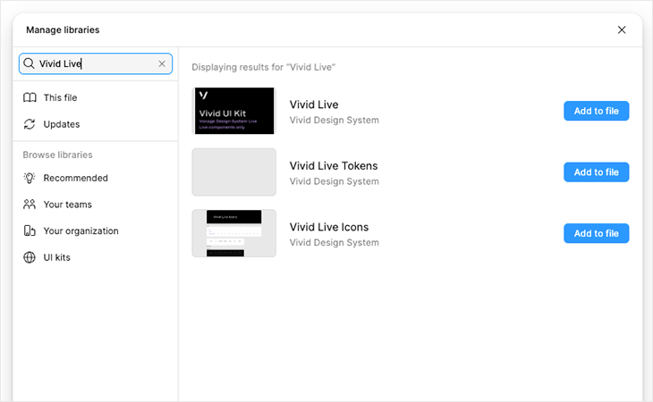
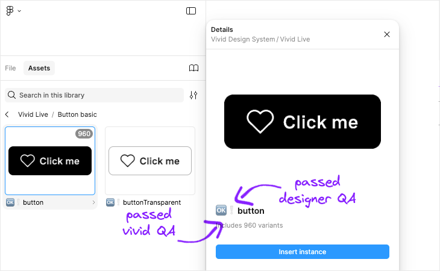
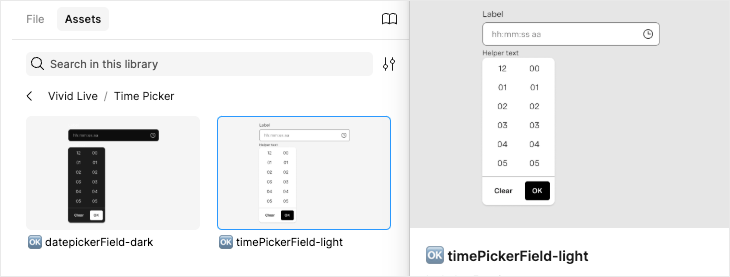
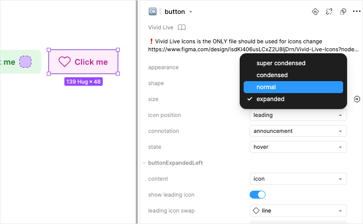
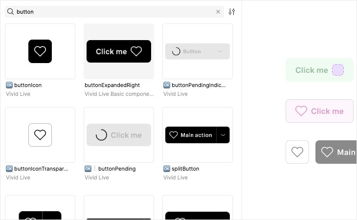
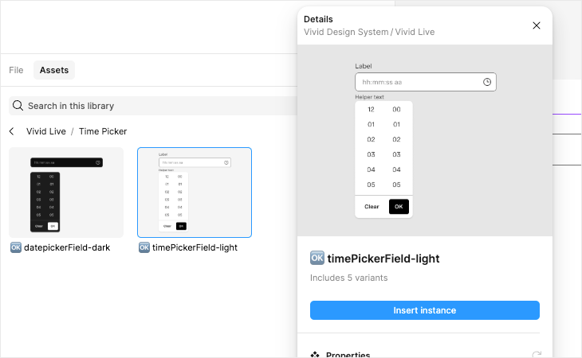

# Introducing Vivid-Live: Figma Component Library

We're thrilled to announce our new Figma component library – a significant upgrade to our previous design system that takes our Vivid components to the next level. If you've been using our existing library, get ready for a transformative design experience.

## Why a New Library?

Our previous Figma library served us well, but we knew we could do better. This new library isn't just an update – it's a complete reimagination of how design components should work.

## What Has Changed In Vivid-Live Library?

### Perfect Alignment with Our Vivid API

Every component is now precisely synchronized with our Vivid API web components. What you design is exactly what developers will implement – eliminating any discrepancies between design and final product.

### Advanced Figma Token Support

We've fully embraced the latest Figma token features, providing:

1. Seamless dark and light mode implementations
2. Consistent color management across design states
3. Enhanced design flexibility

### Improved Organization and Usability

We've completely restructured the library to make:

- Component selection more intuitive
- Navigation smoother and more logical
- Design workflow more efficient

### Advanced Customization

Full control through side panel options

- Easily choose component appearances
- Toggle features on and off
- Set multiple component states with a few clicks
- Component description, extra explanation if needed and link to the docs page

### Smart Compositions

Pre-built, interconnected component setups

- Expertly configured component combinations
- Examples include fully-configured select dropdowns with correct options
- Ready-to-use menu components with pre-populated menu items
- Intuitive connections between related components

## Key Improvements

1. **Complete API Synchronization:** 100% alignment with Vivid API components
2. **Thoroughly Tested:** We've gone the extra mile to make sure everything works perfectly ([Components QA](https://docs.google.com/spreadsheets/d/1-R6p9tJa6agJRDUkpfDNZ8kS4bXjfm7YcVZY4KoZAqg/edit?gid=0#gid=0))
3. **Expanded Component Set:** New components and enhanced features like:

- Searchable select
- Video-player
- Side-Drawer
- Tabs - vertical tabs, removable tab

4. **Flexible Color Systems:** Full support for dark and light modes
5. **Unparalleled Customization:** Granular control over component design

## How to use Vivid-Live

### #1 - adding the library

Vivid Live comes with 2 additional assets:

- [Vivid Live Tokens](<(https://www.figma.com/design/l7PH4EhGm3SXH9FJQBBPZG/Vivid-Live-Tokens?node-id=33646-138859&t=AZY0LVVL7Qe15zCI-1)>)
- [Vivid Live Icons](<(https://www.figma.com/design/isdKI406usLCxZ2U8ljDrn/Vivid-Live-Icons?node-id=274-7267&t=YWWxn3L71PA9Hfuf-1)>)
  Make sure you are adding all 3 of them :)

### #2 - adding components

All components are ordered alphabetically.  
Choose your component and add it.

### #3 - Dark / Light Theme

Most of the components now are not declared as dark / light and can be configured under figma appearance section to meet your theme:

However - when there’s drop-shadow - the tokens are not changing - so you’ll find a component for dark & light.

### #4 - Customize the components

After adding the component - you’ll find all its options in the side panel.  
From size to appearance to stats and text customization.

#### Known issues in customizing components

- We did our best to keep the order of the properties reasonable and intuitive but using inner templates sometimes limited that option.
- We are using inner templates for component variation.
  - Variation options are not always in the right order, although we did our best to keep the order of the properties reasonable and intuitive
  - Some variations re-sets the component data. Make sure you pick the upper options before other customization.
    
- In order to simplify and light components and for better maintenance we separated some components to different components. For example:
  - **Button** has lots of variation - button basic, button basic transparent, stacked button and more:
    
  - **Time Picker** (and same for all components with open drop-downs), we have a component for the input and a component that is composition of the input and a dropdown with the option set that fits for it.
    

### #5 - Slots

Vivid-Live is synced to the API, which means, like the actual components, it uses Slots.
For each slot you can either show / hide the slot and swap the default slot with your content.

### #6 - Composition

Components like select, menu, tabs and more have a component that is built with composition.
You can configure the composition when entering the layer in the layers panel, you’ll see its options in the right panel.

## We're Listening

This library is a living, breathing resource. We're committed to continuous improvement and value your feedback.  
Spot something that could be even better?  
We want to hear from you!  
❤  
The Vivid Design Team
