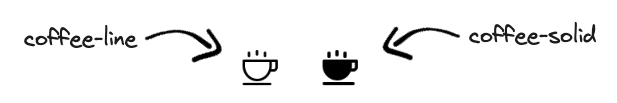
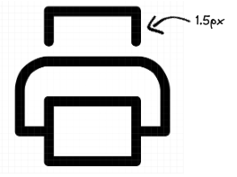
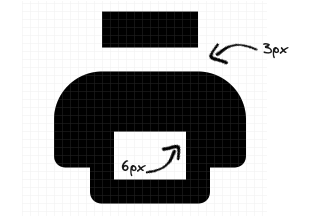

# Adding Icons to the Vivid Icon Set

## Overview

This guide is for designers who want to contribute new icons to the Vivid Icon set.

<vwc-note connotation="announcement" headline="Before You Begin">
  <vwc-icon slot="icon" name="sparkles-line" label="Note:"></vwc-icon>

Before submitting a new icon, ensure it is not already included in the [Icon Gallery](/icons/icons-gallery/).

</vwc-note>

## Icons Structure

The Vivid Icon set organizes icons in pairs. This means that when you submit a new icon, you are actually submitting two icons:

A **line** version and a **solid** version



If the icon contains color (such as a brand icon), additional variations may be required.

A **color** version and a **mono** version


## Creating Icons in Figma

To create a new icon, follow these guidelines:

- Use the icon-starter file (`icon-starter.fig`)
- The icon must be **24px × 24px**
- **Solid**, **line**, and **mono** style icons must be **black**
- The icon should be centered within the **24px square**.
- **Stroke width** for line icons: **1.5px**
- **Distance of parts** for solid icons: **3px**

<vwc-layout auto-sizing="fill" style="--layout-grid-template-columns: 45% 55%;">
  
  
</vwc-layout>

## General Recommendations

- Keep icons clean and simple.
- In line icons, squares or enclosed elements often transform into "holes" in solid icons.<br />
- Preview your icons at **100% scale**.
- Test the icon by duplicating it and resizing to **16px** and **20px** to see how it appears in components.
- Ensure the new icon matches the **Vivid Icons style**. You can copy a section from the icon library and place your icon within it to verify alignment.

## Approving Icons

### Internal Review

1. Review your icon with your team for initial feedback.
2. Add the new icons to the **Not-Vivid Figma file** in a separate page at the bottom of the list.
3. Title the page with an indicator that the icons need to be reviewed.

### Design Team Review

1. Open a **Jira ticket** with a link to the new icon design and assign it to a **Vivid designer**.
2. **Vivid designer** will review the icon to ensure it is aligned with the guidelines.
3. If needed, schedule a review meeting with a **Vivid designer**.
4. Notify the design group about the new icon proposal.

## Submitting the Icons

1. Create a **new Vivid Jira ticket** and attach the icons along with their metadata.
2. Ensure the **SVG files** are named properly:

   ```
   your-iconName-solid.svg
   your-iconName-line.svg
   ```

   If applicable:

   ```
   your-iconName-color.svg
   your-iconName-mono.svg
   ```

### Icon Data

#### Category

All icons belong to a category, which can be found in the **Figma icons file** or the **Vivid Docs icon gallery**.

Specify the category for each icon pair.

#### Keywords

Keywords improve searchability in Figma.

- Assign relevant keywords to each icon set.
- Both icons in a set can share the same keywords.

**Example:**

```
calendar-solid.svg
calendar-line.svg
Category: Date
Keywords: event-confirm, schedule, confirmation, check
```

## Adding Icons to Vivid Icons Library

### What Happens Next?

After submission, the icons go through the following process:

1. The **Jira ticket** enters the **Vivid sprint**.
2. The icons are added to the **Vivid Icons repository**.
3. A new icon set is created for the **API**.
4. The icons are processed using the **Vivid plugin** and a new update is published in **Figma**.

### Timeline

The integration process will follow our sprint cadence so can take up to **2 weeks**.

Once completed, the new icons will be available in both **Figma** and the **API**. 🎉
